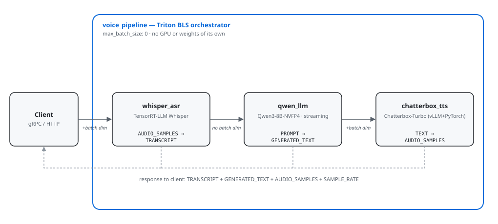

# Speech Cascade Inference

A real-time voice pipeline — speech in, speech out — served through NVIDIA
Triton Inference Server. Audio is transcribed (Whisper), answered by an LLM
(Qwen3-8B), and spoken back (Chatterbox TTS), all GPU-accelerated.

## Architecture

<picture>
  <source media="(prefers-color-scheme: dark)" srcset="assets/architecture-dark.svg">
  <source media="(prefers-color-scheme: light)" srcset="assets/architecture-light.svg">
  
</picture>

| Model | Runtime | Input -> Output |
|---|---|---|
| `whisper_asr` | TensorRT-LLM Whisper | `AUDIO_SAMPLES` -> `TRANSCRIPT` |
| `qwen_llm` | Qwen3-8B-NVFP4 on TensorRT-LLM, streaming | `PROMPT` -> `GENERATED_TEXT` |
| `chatterbox_tts` | Chatterbox-Turbo (vLLM + PyTorch) | `TEXT` -> `AUDIO_SAMPLES` |
| `voice_pipeline` | Orchestrates the three above | audio in -> transcript, reply, audio out |

Clients connect through the **streaming gateway** (`streaming_gateway/`), a
WebSocket service in front of Triton that handles auth, voice-activity
detection, and streaming responses. Triton itself is never exposed directly.

## Quick start

Requires a Linux host with an NVIDIA GPU (16GB+ VRAM), Docker, and
`nvidia-container-toolkit`.

```bash
cp .env.example .env    # set GATEWAY_API_KEYS (or GATEWAY_AUTH_TOKEN)
docker compose pull     # pulls ghcr.io/raoashish10/speech-cascade-{triton,gateway}
docker compose up -d
```

On first start, the Triton container downloads the model weights and builds
the engines for your GPU (a few minutes). The gateway then listens on port
`18010` — connect with `scripts/test_streaming_client.py`.

More detail — deploying on Runpod, building images yourself, startup
timings — is in [`docker/README.md`](docker/README.md).

### Bare-metal alternative

To run without Docker, follow [`deploy/REBUILD.md`](deploy/REBUILD.md) (or
automate it with `deploy/ansible/`). The service then runs under supervisor:

```bash
supervisorctl restart speech-cascade-triton
```

## Checking it works

```bash
# Model status (Docker: prefix with `docker compose exec triton`)
curl -X POST http://localhost:18000/v2/repository/index

# Try the LLM on its own
curl -s -X POST http://localhost:18000/v2/models/qwen_llm/infer \
  -H "Content-Type: application/json" \
  -d '{"inputs":[{"name":"PROMPT","shape":[1,1],"datatype":"BYTES","data":["Hello, my name is"]}]}'
```

For load testing: `python3 scripts/load_test.py --concurrency 4 --total-requests 20`.

## Viewing metrics in Grafana

A pre-built dashboard, **Speech Cascade — Triton Monitoring**, shows
per-model throughput, failures, queue and compute time, GPU utilization and
memory, and whether each model is `READY`. Prometheus feeds it by scraping
Triton every 2 seconds.

Grafana listens on port `13000` of the GPU host, localhost only, so open an
SSH tunnel and browse to the dashboard:

```bash
ssh -L 13000:localhost:13000 <gpu-host>
# then open http://localhost:13000/d/speech-cascade-triton
```

Viewing needs no login. To edit, sign in as `admin` with the password from
`GRAFANA_ADMIN_PASSWORD` (default `speechcascade` — set your own).

Grafana and Prometheus currently run as supervisor services in the
bare-metal deployment only. With Docker, import
`monitoring/grafana/dashboards/speech-cascade.json` into your own Grafana,
backed by a Prometheus that scrapes Triton's metrics port (`18002`).

## Project layout

```
triton_model_repo/   The four Triton models (model.py + config.pbtxt each)
streaming_gateway/   WebSocket gateway clients connect to
docker/              Dockerfiles and container deployment guide
deploy/              Bare-metal setup: runbook, supervisor configs, Ansible
monitoring/          Grafana dashboard + Prometheus alert rules
scripts/             Load testing, profiling, and model-build scripts
tests/               Unit tests (run in CI) and GPU integration tests
```

## Development

```bash
python -m pytest tests/unit -v          # no GPU needed; runs in CI
python -m pytest tests/integration -v   # needs a running server
```

Tuning knobs (VRAM limits, batching, concurrency caps) live in each model's
`config.pbtxt`. Profiling guidance is in
[`deploy/PROFILING.md`](deploy/PROFILING.md).
